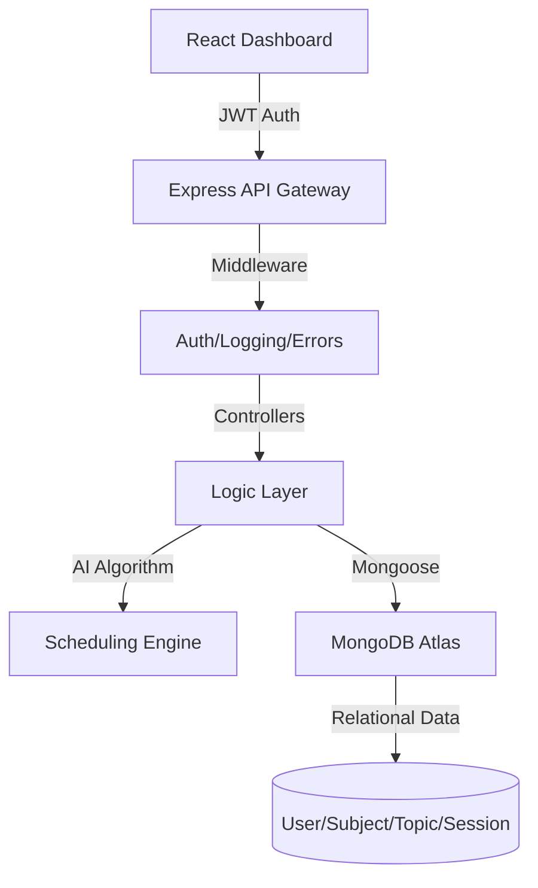

# 🎓 Smart Study Planner - AI-Powered Full-Stack Assistant (Advanced Version)

---

## 🔥 Top-Tier Upgrades (New!)

### 🔐 1. Industrial-Strength Authentication
- **JWT + Bcrypt**: Full Login/Register flow with password hashing and token-based session persistence.
- **Strict Protected Routes**: Middleware-enforced access control for all API endpoints.

### 🗄️ 2. Advanced Relational DB Design
- **Hierarchical Schema**: `User` → `Subjects` → `Topics` → `StudySessions`.
- **Referential Integrity**: Managed via Mongoose populated paths.

### 🧠 3. Smart Scheduling Engine (AI-Powered)
- **Difficulty Weights**: Topics are weighted (1-5) to adjust session length and priority.
- **Revision Cycles**: Logic that prioritizes older, unstudied topics to ensure balanced learning.

### 📈 4. Real-Time Productivity Analytics
- **Study Streaks**: Automated tracking of consecutive study days.
- **Productivity Scores**: Metrics derived from user-reported session quality.

---

## 🏗️ System Architecture

---

## 🚀 API Endpoints (RESTful)

| Method | Endpoint | Description |
| :--- | :--- | :--- |
| `POST` | `/api/auth/register` | Register a new student |
| `POST` | `/api/auth/login` | Login and receive JWT |
| `GET` | `/api/ai/plan` | Generate AI-weighted study plan |
| `GET` | `/api/analytics/productivity` | Get streaks and scores |

---

## 🛠️ Local Setup

1. **Install**: `npm run install-all`
2. **Configure**: Add `JWT_SECRET` and `MONGO_URI` to `backend/.env`.
3. **Run**: `npm run dev`

---

*Built with ❤️ for top-tier placement opportunities.*